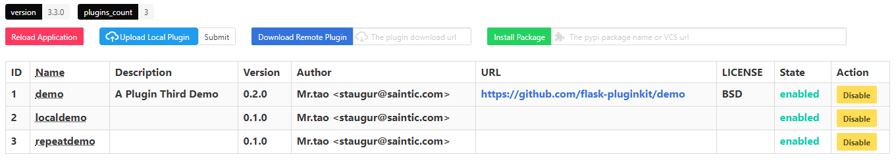
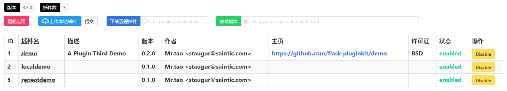

.. _webmanager:

Web Manager
===========

In v3.3.0, the previous version of blueprint was restored and enhanced,
and the plugin installation function was added.

You can register blueprint in your web application and
set the blueprint prefix. The steps are as follows:

.. code-block:: python

    from flask import Flask
    from flask_pluginkit import PluginManager, blueprint
    app = Flask(__name__)
    PluginManager.init_app(app)
    app.register_blueprint(blueprint, url_prefix='/pluginmanager')

Launch the app, visit the /pluginmanager page, take our `example-fulldemo`_
as an example, the rendering is:

This page supports Chinese and English bilingual(The picture is old, the new
version supports the language of choice), the following is the Chinese page
effect:

.. _example-fulldemo:
    https://github.com/staugur/Flask-PluginKit/tree/master/examples/fulldemo

Instructions
------------

This blueprint has only one page. This page contains three main features:

.. _webmanager-disable-enable-plugins:

- Disable, Enable Plugins

.. _webmanager-reload-application:

- Reload Application

    Disabling or enabling plugins will require a reloaded application
    to take effect. For security reasons, there are some restrictions
    on overloaded applications.

    It can only be used in a formal environment that uses Gunicorn or uWSGI
    background startup, and requires that the value of **ENV** in the
    application's configuration item be **production**, and you also need to
    manually install the psutil module, eg: ``pip install psutil``.

    If you use Gunicorn, you need the value of **PLUGINKIT_GUNICORN_ENABLED**
    in the application's configuration item to be True, and the value of
    **PLUGINKIT_PROCESSNAME** is the specific program process name.

    .. note::

        Gunicorn starts in master-worker mode in the background. The required
        **PLUGINKIT_PROCESSNAME** is the name of the master process. It does
        not contain **gunicorn: master []**, which is the process name in
        **[]**. There is no default value.

    If you use uWSGI, you need the value of the application configuration item
    **PLUGINKIT_UWSGI_ENABLED** to be True, **PLUGINKIT_PROCESSNAME** is uwsgi
    by default, generally speaking, you don't have to modify it.

    The application can be reloaded normally after the appeal is met.
    Here is an example:

    .. code-block:: bash

        $ pip install psutil

        $ cat app.py

        from flask_pluginkit import Flask, blueprint, PluginManager
        app = Flask(__name__)
        app.config.update(
            ENV='production',
            PLUGINKIT_GUNICORN_ENABLED=True,
            PLUGINKIT_PROCESSNAME="app:app"
        )
        pm = PluginManager(app)
        app.register_blueprint(blueprint, url_prefix='/pluginmanager')

        $ gunicorn -b 127.0.0.1:5000 app:app --daemon

        $ ps aux | grep -v grep | grep gunicorn

        root   master-pid   ......   gunicorn: master [app:app]
        root   worker-pid   ......   gunicorn: worker [app:app]

    .. tip::

        Flask v1.0 has an ENV configuration added.
        The default value is production.

.. _webmanager-install-plugins:

- Install Plugins

    The first two operations are simple, and the third feature requires
    detailed instructions.

    There are three situations for installing plugins:

    .. _webmanager-upload-local-plugin:

    - Upload Local Plugin

        This will upload a compressed file to your server's temp directory and
        extract it to the web application's plugin directory (controlled by
        :meth:`~flask_pluginkit.PluginManager.__init__`). Repeatedly uploading
        a compressed file will overwrite the uncompressed file.

    .. _webmanager-download-remote-plugin:

    - Download Remote Plugin

        Similar to the above situation, instead of uploading the local
        compressed file, download the remote compressed file to the temporary
        directory of your server. The subsequent steps are the same as above.

        The remote url here is very strict. It must be a valid download address
        for compressed file and can resolve valid file names(That is, the file
        suffix is .tar.gz, .tgz or .zip).
        It is worth mentioning that Flask-PluginKit provides four methods to
        automatically obtain the file name of the remote url.
        Basically meet the requirements(Number Represents Priority):

        1. Add url **plugin_filename** query parameters

        2. The file name is resolved in the url

        3. Parse the **Content-Disposition** in the return header

        4. Parse the **Content-Type** in the return header

        Examples of valid URL parameters in the input box:

        .. code-block:: text

            for 1, http://xx.com/download?plugin_filename=xx.zip
            for 2, http://xx.xx.com/plugin-v0.0.1.tar.gz
            for 3 and 4, https://codeload.github.com/saintic/flask-pluginkit-demo/zip/master

    .. _webmanager-install-package:

    - Install Package

        This situation is new. It relies on the interface of the pip module to
        directly install the remote compression package. It can be a pypi package
        or a VCS project URL. It can be directly installed into the python global
        environment. You need to manually pass the
        :attr:`~flask_pluginkit.PluginManager.plugin_packages` call.

        Example of input box parameters:

        .. code-block:: text

            flask-pluginkit-valine
            git+https://github.com/saintic/flask-pluginkit-demo@master

        .. note::

            Since it takes time to install the module, this will turn on thread
            processing. After the installation is successful, it will be handed
            over to a message queue. The page will query the message every
            5 seconds and display it.

Authentication
--------------

The web management page is actually dangerous for administrators. If others
are free to access, it may be harmful to the system. Therefore,
before accessing this blueprint, a hook function is run
to authenticate the visitor.

Verify that the visitor currently supports four main methods and
one helper method. The former is defined by the application configuration item
``PLUGINKIT_AUTH_METHOD``, which is defined by ``PLUGINKIT_AUTH_AID_METHOD``.

.. _webmanager-auth-method:

- **PLUGINKIT_AUTH_METHOD**, supports four types of values.

    - BOOL

        This method will get the value of the **PLUGINKIT_AUTH_BOOLFIELD**
        field in the configuration via :data:`flask.g` (the default value is
        signin). When it is True, it will be verified.

        Example:

        .. code-block:: python

            from flask import Flask, g
            from flask_pluginkit import blueprint, PluginManager
            app = Flask(__name__)
            pm = PluginManager(app)
            app.config.update(
                PLUGINKIT_AUTH_METHOD="BOOL",
                PLUGINKIT_AUTH_BOOLFIELD="auth"
            )
            app.register_blueprint(blueprint, url_prefix='/pluginmanager')

            @app.before_request
            def br():
                g.auth = True

    - BASIC

        HTTP Basic Auth, a simple but unsafe method, this method requires
        username and password, so the application configuration item
        **PLUGINKIT_AUTH_USERS** is required, which is a dict, the key is
        username, the value is password, and multiple keys and values are
        supported. Optional configuration **PLUGINKIT_AUTH_REALM** to set the
        prompt information.

        Example:

        .. code-block:: python

            from flask_pluginkit import Flask, blueprint, PluginManager
            app = Flask(__name__)
            pm = PluginManager(app)
            app.config.update(
                PLUGINKIT_AUTH_METHOD="BASIC",
                PLUGINKIT_AUTH_USERS=dict(admin="admin", test="test")
            )
            app.register_blueprint(blueprint, url_prefix='/pluginmanager')

    - TOKEN

        This requires the browser to carry an authentication header. The header
        field is defined by the application configuration item
        **PLUGINKIT_AUTH_TOKENFIELD**. The default value is AccessToken.
        At the same time, it is required to configure a function or
        class method named **PLUGINKIT_AUTH_CHECKTOKEN**. Receiving a token
        parameter, Flask-PluginKit will execute this function, and the result
        will be verified when the non-zero and non-empty.

        Example:

        .. code-block:: python

            from flask_pluginkit import Flask, blueprint, PluginManager
            app = Flask(__name__)
            pm = PluginManager()
            pm.init_app(app)

            def check_token(token):
                if token == 'test':
                    return True

            app.config.update(
                PLUGINKIT_AUTH_METHOD="TOKEN",
                PLUGINKIT_AUTH_CHECKTOKEN=check_token
            )
            app.register_blueprint(blueprint, url_prefix='/pluginmanager')

    - FUNC

        This should be the easiest, defined by the application configuration
        item **PLUGINKIT_AUTH_FUNC**, a function or class method, etc,
        no parameters, the execution result is non-zero and non-empty
        when the verification is passed.

        Example:

        .. code-block:: python

            from flask_pluginkit import Flask, blueprint, PluginManager
            app = Flask(__name__)
            PluginManager(app)
            app.config.update(
                PLUGINKIT_AUTH_METHOD="FUNC",
                PLUGINKIT_AUTH_FUNC=lambda :True
            )
            app.register_blueprint(blueprint, url_prefix='/pluginmanager')

.. _webmanager-auth-aid-method:

- **PLUGINKIT_AUTH_AID_METHOD**, supports one type of value.

    - IP

        Flask-pluginkit will get the client IP, requires application
        configuration item **PLUGINKIT_AUTH_IP_WHITELIST** to define IP
        whitelist, and **PLUGINKIT_AUTH_IP_BLACKLIST** to define IP blacklist.
        Both data types are lists, and only when IP is in the whitelist and
        not on the blacklist, it can be verified.

        Example:

        .. code-block:: python

            from flask_pluginkit import Flask, blueprint, PluginManager
            app = Flask(__name__)
            PluginManager(app)
            app.config.update(
                PLUGINKIT_AUTH_AID_METHOD="IP",
                PLUGINKIT_AUTH_IP_WHITELIST=["127.0.0.1"]
            )
            app.register_blueprint(blueprint, url_prefix='/pluginmanager')

.. note::

    In an application, the four types of the main method can only be used one
    or not; the auxiliary method can be used with the main method
    at the same time, or it can be used alone; in any case, there must be a
    verification method, otherwise the page prompt permission is rejected.

