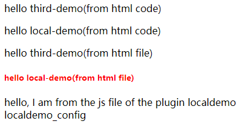

### Example

The demo plugin in this example (located in plugins/local_demo) basically contains all the feature points currently provided by Flask-PluginKit.

#### Installation

1. Installation dependency package

```bash
$ pip install -r requirements.txt
```

2.  Run

```bash
FLASK_ENV=development FLASK_APP=app.py flask run --no-reload
```

3. The page is probably like this:


